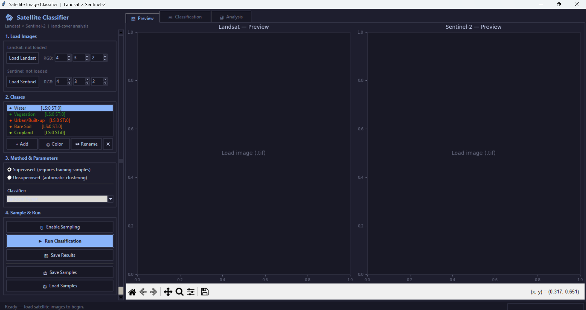

# 🛰️ Satellite Image Classifier — Landsat × Sentinel-2

A desktop GUI application for **supervised and unsupervised land-cover classification** of satellite imagery. Built with Python and Tkinter, it lets you load GeoTIFF files from Landsat and Sentinel-2, draw training samples, run ML classifiers, and compare results side by side.



---

## 📋 Table of Contents

- [Overview](#overview)
- [Features](#features)
- [Requirements](#requirements)
- [Installation](#installation)
- [Satellite Image Data](#satellite-image-data)
- [How to Run](#how-to-run)
- [Usage Walkthrough](#usage-walkthrough)
- [Classification Methods](#classification-methods)
- [Output & Results](#output--results)
- [Alternative: Google Earth Engine (GEE) Version](#alternative-google-earth-engine-gee-version)
- [Project Structure](#project-structure)

---

## Overview

This tool performs **land-cover classification** on multi-band satellite imagery by comparing two sensors:

| Sensor | Image Size | Radiometry | Bands |
|---|---|---|---|
| Landsat 8/9 OLI | 260 × 298 px | float64 | 4 (VNIR + SWIR + Thermal) |
| Sentinel-2 MSI L2A | 780 × 891 px | uint16 | 4 (VNIR + 3 Red-Edge + SWIR) |

**Study area:** Powai & Vihar Lake region, Mumbai, India — a mixed urban/water/vegetation scene ideal for multi-class land-cover analysis.

The app produces classified land-cover maps, accuracy assessments, and a detailed report comparing how spatial, spectral, and radiometric resolution affect classification performance.

---

## Features

- **Dual-sensor workflow** — load Landsat and Sentinel-2 `.tif` files simultaneously
- **Supervised classification** — draw training samples on-screen for each land-cover class
- **Unsupervised classification** — automatic clustering (no labelling needed)
- **5 supervised classifiers** — Random Forest, SVM, K-Nearest Neighbours, Decision Tree, Naive Bayes
- **2 unsupervised algorithms** — K-Means, Gaussian Mixture Model (GMM)
- **Accuracy assessment** — Overall Accuracy, Kappa coefficient, confusion matrix, per-class Precision/Recall
- **Cross-validation** — stratified 5-fold CV with 70/30 train-test split
- **Map decorations** — auto-generated lat/lon tick labels, scale bar, north arrow
- **Export** — save classified maps as PNG and full text report
- **Save/Load samples** — reuse training points across sessions (JSON format)
- **Custom classes** — add, rename, recolour, or delete land-cover classes

---

## Requirements

### Python version

Python **3.8 or higher** is required.

### Dependencies

```
rasterio
scikit-learn
scipy
matplotlib
numpy
```

> Tkinter is included with the standard Python installer on Windows and macOS. On Linux, install it with:
> `sudo apt install python3-tk`

---

## Installation

**1. Clone or download this repository**

```bash
git clone https://github.com/<your-username>/<repo-name>.git
cd <repo-name>
```

**2. (Optional but recommended) Create a virtual environment**

```bash
python -m venv venv

# Windows
venv\Scripts\activate

# macOS / Linux
source venv/bin/activate
```

**3. Install dependencies**

```bash
pip install rasterio scikit-learn scipy matplotlib numpy
```

> **Note on rasterio (Windows):** If `pip install rasterio` fails on Windows, install via conda or use a pre-built wheel from [Christoph Gohlke's repository](https://github.com/cgohlke/geospatial-wheels).

---

## Satellite Image Data

This tool requires **downloaded GeoTIFF (`.tif`) files** for Landsat and/or Sentinel-2.

### Where to download

| Source | Data Type | Link |
|---|---|---|
| USGS EarthExplorer | Landsat 8/9 Collection 2 | https://earthexplorer.usgs.gov |
| Copernicus Browser | Sentinel-2 L2A | https://browser.dataspace.copernicus.eu |
| Google Earth Engine | Both (export to Drive) | https://code.earthengine.google.com |

### 📥 Sample data used in this project

The exact satellite images used in this project are included in the `data/` folder of this repository:

```
data/
├── Landsat9_Powai_Vihar_Single.tif      # Landsat 9 OLI — 4-band GeoTIFF, WGS 84
└── Sentinel2_Powai_Vihar_Single.tif     # Sentinel-2 MSI L2A — 4-band GeoTIFF, WGS 84
```

> **Note:** GeoTIFF files can be large. If GitHub rejects them due to size limits (>100 MB), they will be stored using [Git LFS](https://git-lfs.github.com/) — install Git LFS and run `git lfs pull` after cloning to download the data files.

### File format requirements

- Format: **multi-band GeoTIFF** (`.tif` / `.tiff`)
- Landsat: load the stacked multi-band file (e.g., `LC09_..._SR_B1-7.tif`)
- Sentinel-2: load the stacked or individual band file (e.g., `T44RNR_..._10m.tif`)
- The app reads any number of bands; you select which bands to display as RGB using the spinboxes in the sidebar

---

## How to Run

```bash
python satellite_classifier.py
```

The GUI window will open at 1440×860 px. If any required package is missing, a warning dialog will list what to install.

---

## Usage Walkthrough

Follow these steps in order inside the app:

### Step 1 — Load Images

- Click **Load Landsat** and select your Landsat `.tif` file
- Click **Load Sentinel** and select your Sentinel-2 `.tif` file
- Use the **RGB spinboxes** next to each button to choose which bands to display as red, green, and blue (default: 4-3-2 for a natural colour composite)
- The **Preview** tab shows both images side-by-side with lat/lon axes, a scale bar, and a north arrow

### Step 2 — Define Classes

The app starts with five default classes: Water, Vegetation, Urban/Built-up, Bare Soil, and Cropland.

- **+ Add** — create a new class with a custom name and colour
- **🎨 Color** — change the colour of the selected class
- **✏ Rename** — rename the selected class
- **✕ Del** — delete the selected class

### Step 3 — Choose Method & Parameters

**Supervised:**
- Select a classifier from the dropdown (Random Forest is recommended as a starting point)
- You must collect training samples (Step 4) before running

**Unsupervised:**
- Choose K-Means or Gaussian Mixture Model
- Set the number of clusters, maximum iterations, and n_init runs

### Step 4 — Collect Training Samples (Supervised only)

1. Select a class in the class list
2. Click **Enable Sampling** — the button turns highlighted when active
3. Click on the image in the **Preview** tab to drop sample points for that class
4. Repeat for every class; aim for at least 30–50 points per class
5. Click **Enable Sampling** again to turn off sampling mode

> **Tip:** Click directly on the image preview, not on blank canvas area. Sample points appear as coloured dots overlaid on the image.

### Step 5 — Run Classification

- Click **▶ Run Classification**
- A progress bar and status messages appear at the bottom
- Classification runs in a background thread so the UI stays responsive
- When complete, the **Classification** tab shows the coloured land-cover map and the **Analysis** tab shows accuracy charts

### Step 6 — Save Results

- **💾 Save Results** — choose a folder; saves classified map PNGs and a full text report
- **📤 Save Samples** — save your training points to a JSON file for later reuse
- **📥 Load Samples** — reload previously saved training points

---

## Classification Methods

### Supervised

| Classifier | Notes |
|---|---|
| Random Forest | 150 trees, `n_jobs=-1` (parallel). Best general-purpose choice. |
| SVM (RBF) | Kernel `rbf`, `C=10`, `gamma='scale'`. Slow on large datasets. |
| K-Nearest (5) | `k=5`, `n_jobs=-1`. Good for compact, separable classes. |
| Decision Tree | `max_depth=20`. Fast, interpretable, prone to overfitting. |
| Naive Bayes | Gaussian NB. Very fast, assumes feature independence. |

All supervised classifiers use:
- `StandardScaler` normalisation
- 70/30 stratified train-test split
- 5-fold stratified cross-validation
- Accuracy, Kappa, confusion matrix, Producer's/User's accuracy

### Unsupervised

| Algorithm | Notes |
|---|---|
| K-Means | Standard clustering; uses inertia score |
| Gaussian Mixture (GMM) | Soft probabilistic clustering; uses BIC score |

Cluster labels are matched to your defined class names using the **Hungarian algorithm** (`scipy.optimize.linear_sum_assignment`).

---

## Output & Results

After running classification, the following outputs are generated:

| Output | Description |
|---|---|
| **Classification tab** | Colour-coded land-cover map with legend |
| **Analysis tab** | Bar charts of class coverage, spectral band profiles, and accuracy comparison |
| `ls_classified_<timestamp>.png` | Exported Landsat classification map |
| `st_classified_<timestamp>.png` | Exported Sentinel-2 classification map |
| `analysis_<timestamp>.png` | Exported analysis charts |
| Text report (in Save dialog) | Full accuracy assessment, confusion matrix, resolution comparison |

The text report covers:
- Dataset metadata (file name, size, bands, spatial resolution, CRS)
- Per-class sample counts
- Overall Accuracy (OA), Kappa coefficient, CV folds
- Confusion matrix with Producer's and User's Accuracy
- Resolution effects analysis (spatial, spectral, radiometric)
- Conclusion comparing Landsat vs Sentinel-2 performance

### 📂 Sample results

The `results/` folder in this repository contains sample outputs generated from the data in `data/`, so you can see what to expect before running the tool yourself:

```
results/
├── ls_classified_<timestamp>.png    # Landsat land-cover map
├── st_classified_<timestamp>.png    # Sentinel-2 land-cover map
├── analysis_<timestamp>.png         # Accuracy & analysis charts
└── report_<timestamp>.txt           # Full classification report
```

---

## Alternative: Google Earth Engine (GEE) Version

A Google Colab notebook (`gee_classifier.py`) is included in this repo as an alternative if you do not have locally downloaded satellite images. It pulls imagery directly from the GEE data catalogue and runs unsupervised K-Means classification entirely in the cloud.

**How to use:**
1. Open [Google Colab](https://colab.research.google.com)
2. Upload `gee_classifier.py` or paste the code into a new notebook
3. Run all cells — it will prompt you to authenticate with your Google Earth Engine account
4. Set your ROI coordinates, date range, and number of clusters in the input panel
5. Click **Run** — four synced interactive maps appear (Sentinel TCC, Landsat TCC, Sentinel classified, Landsat classified)

**What it does differently from the main app:**

| Feature | Main app (`satellite_classifier.py`) | GEE version (`gee_classifier.py`) |
|---|---|---|
| Data source | Local `.tif` files | GEE cloud catalogue |
| Classification | Supervised + Unsupervised | Unsupervised (K-Means) only |
| Interface | Desktop GUI (Tkinter) | Google Colab widgets |
| Output | PNG maps + text report | Interactive synced maps |
| Requires download | Yes | No |

**Dependencies (auto-installed in Colab):**
```
geemap, earthengine-api, ipywidgets, rasterio
```

> You need a Google Earth Engine account to use this. Sign up free at [earthengine.google.com](https://earthengine.google.com). Change the `PROJECT_ID` variable at the top of the file to your own GEE project ID.

---

## Project Structure

```
.
├── satellite_classifier.py                   # Main application
├── gee_classifier.py                         # Google Colab / GEE alternative
├── requirements.txt                          # Python dependencies (main app)
├── README.md                                 # This file
├── preview.png                               # Screenshot of the app UI
├── data/
│   ├── Landsat9_Powai_Vihar_Single.tif       # Landsat 9 GeoTIFF (study area)
│   └── Sentinel2_Powai_Vihar_Single.tif      # Sentinel-2 GeoTIFF (study area)
├── results/                                  # Sample outputs from a completed run
│   ├── ls_classified_<timestamp>.png
│   ├── st_classified_<timestamp>.png
│   ├── analysis_<timestamp>.png
│   └── report_<timestamp>.txt
└── samples/                                  # (Optional) saved training sample JSON files
```

---

## Results Summary (This Project)

Classifier used: **SVM (RBF)** — `C=10`, `gamma='scale'`  
Study area: **Powai & Vihar Lake, Mumbai, India**  
Classes: Water, Vegetation, Urban/Built-up, Bare Soil  
Training samples collected via the GUI (click-to-sample on the Preview tab)

| Metric | Landsat 9 | Sentinel-2 |
|---|---|---|
| Overall Accuracy (OA) | 98.39% | 98.51% |
| Kappa Coefficient | 0.9775 | 0.9790 |
| CV Accuracy (mean ± std) | 98.10% ± 0.84% | 98.16% ± 0.60% |
| Training pixels | 1,159 | 1,253 |
| Test pixels (30% hold-out) | 497 | 538 |

**Sentinel-2 outperformed Landsat by 0.06% CV accuracy** — a narrow gap typical of spectrally homogeneous scenes (lake + dense urban + vegetation patches). In more heterogeneous landscapes the margin widens significantly.

Lowest per-class accuracy was **Bare Soil on Landsat (PA 94.1%)**, likely due to spectral confusion with Urban/Built-up at 30 m resolution where mixed pixels blend impervious surfaces and exposed earth.

> Full confusion matrices, per-class Precision/Recall/F1, and resolution analysis are in [`results/report_20260429_022522.txt`](results/report_20260429_022522.txt).

---

## Notes & Tips

- The app detects missing packages at startup and tells you what to install
- You can load just one sensor (Landsat or Sentinel-2 only) and still run classification
- RGB band indices use 1-based counting (band 1 = first band in the file)
- For Landsat 8/9 Collection 2 SR stacks: B2=Blue, B3=Green, B4=Red, B5=NIR — so default RGB 4-3-2 gives a natural colour view
- For Sentinel-2: B4=Red, B3=Green, B2=Blue in a standard 10m stack — same 4-3-2 convention
- Larger images will take longer to classify; consider clipping to your area of interest before loading

---

---

## Team

| Name | Institute |
|---|---|
| Nitish Kumar Singh | CSRE, IIT Bombay |
| Sajay SS | CSRE, IIT Bombay |
| Satyendranath Kar | CSRE, IIT Bombay |

*Submitted for GNR 630 — CSRE, IIT Bombay — April 2026*
